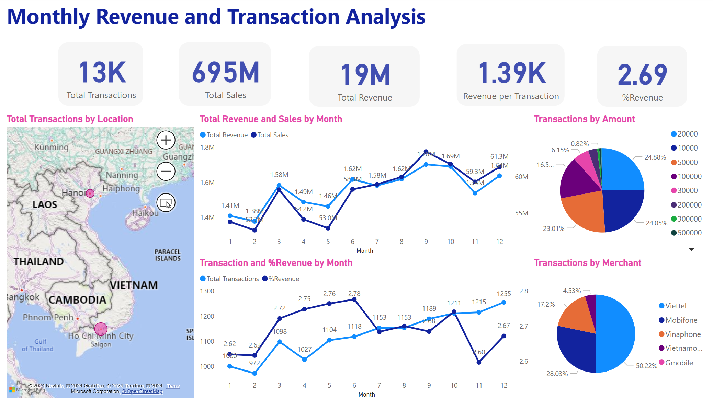
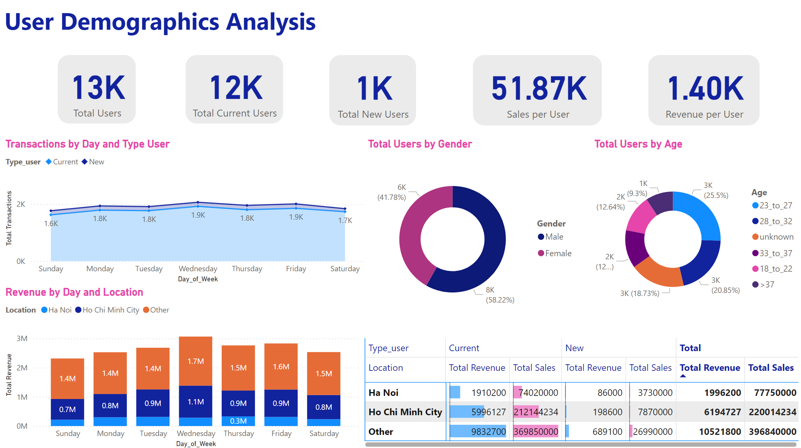

<h1 align="center">
   
  Top-Up Service Performance Analysis
   
</h1>
<h4 align="center">
  Transforming Data Into Valuable Insights For Strategic Growth
</h4>

## Overview

This my personal project to analyzes the performance of a **top-up service** provided by **e-wallet companies**. These services allow users to add money to their e-wallets, and the e-wallet providers earn commissions from Telco merchants for each transaction.

### Analysis Steps:
1. **Exploring the dataset:** Understanding the business model and all dataset fields.
2. **Defining problems:** Identifying the KPIs for performance tracking based on the entire dataset.
3. **Data processing:** Using **Python (Pandas DataFrame)**.
4. **Data visualization:** Utilizing **Power BI**.
5. **Analysis and insights**.

## Data Exploration

The top-up service data includes daily transactions (table '**Transactions**'), user demographic information (table '**User_info**'), and the commission percentage paid by Telco merchants (table '**Commission**').

### Transactions:

| **Field**           | **Description**                                  |
|---------------------|--------------------------------------------------|
| User_id           | Unique ID for each user                          |
| Order_id          | Unique ID for each transaction                   |
| Date              | Date of the transaction                          |
| Amount            | Transaction amount (VND)                         |
| Merchant_id       | Unique ID for each merchant                      |
| Purchase_status   | Label 'Mua hộ' if the user buys a card for another user |

### Commission:

| **Field**           | **Description**                                  |
|---------------------|--------------------------------------------------|
| Merchant_name     | Telco name                                       |
| Merchant_id       | Unique ID for each merchant                      |
| Rate_pct          | Commission percentage (%) for each transaction amount |

### User_Info:

| **Field**           | **Description**                                  |
|---------------------|--------------------------------------------------|
| User_id           | Unique ID for each user                          |
| First_tran_date   | First day of using the top-up service            |
| Gender            | Male/Female                                      |
| Age               | Age groups                                       |
| Location          | Location on the ID card                          |

## Problem Statements

Before the analysis, I explored the data to gain a comprehensive understanding. From this exploration, I defined the following problems to solve:

1. What is the **monthly transaction count** and **revenue** ?
2. Which locations have the **most transactions** ?
3. Which Telco merchant dominates the **top-up market in Vietnam**, and which denominations are **most popular** ?
4. What is the **total number of users**, and how many are **new versus returning users** ?

### KPIs for Analysis:

- **📊 Total Transactions:** **Count of `Order_id`**
- **💰 Total Revenue:** **Sum of `Amount` * `Rate_pct` per transaction**
- **🛒 Total Sales:** **Sum of all `Amount`**
- **📈 Revenue per Transaction:** **Total Revenue / Total Transactions**
- **⚖️ %Revenue:** **Total Revenue / Total Sales**
- **👥 Total Users:** **Distinct count of `User_id`**
- **🔄 New/Current Users:** **Identified based on `First_tran_date` and transaction dates**
- **💵 Sales/Revenue per User:** **(Total Sales/Total Revenue) / Total Transactions**

  
## Data Processing

Based on the defined KPIs, data processing involves checking for null values, duplicate data, and standardizing columns. The notebook `DataProcessing.ipynb` details the data processing steps, including:
- Checking for **null values** and **duplicates**
- Processing **dates columns**
- Creating **derived columns** such as `[month]`, `[Day_of_Week]`, `[Revenue]`, and `[Type_user]`
- Standardizing the `[Gender]` and `[Location]` columns

## Data Visualization

Using **Power BI** for building dashboard to track performance and user demographics.  

## Analysis and Insights

1. **What is the monthly transaction count and revenue?**
   - **Monthly Trends**:
     - **Highest Transactions**: December (1,255 transactions)
     - **Lowest Transactions**: February (972 transactions)
     - **Trend**: Upward from 972 in January to 1,255 in December
   - **Total Sales**: 19 million VND
   - **Average Revenue/Transaction**: 1,400 VND

2. **Which locations have the most transactions?**
   - **Highest Transactions by Location**: Ho Chi Minh City
   - **Average Revenue/User**:
     - **Ho Chi Minh City**: 1,500 VND (returning), 1,134 VND (new)

3. **Which Telco merchant dominates the top-up market in Vietnam, and which denominations are most popular?**
   - **Dominant Telco Merchant**:
     - **Viettel**: 50.22%
     - **Mobifone**: 28%
     - **Vinaphone**: 17.2%
     - **Others**: 4.5%
   - **Popular Denominations**:
     - **20,000 VND**: 24.88%
     - **10,000 VND**: 24%
     - **50,000 VND**: 23%
     - **100,000 VND**: 16.5%

4. **What is the total number of users, and how many are new versus returning users?**
   - **Total Users**: ~13,000
   - **New Users**: ~1,000
   - **Average Sales/User**: 51,000 VND
   - **Average Revenue/User**: 1,400 VND
   - **Gender Distribution**:
     - **Male**: 58.22%
     - **Female**: 41.78%
   - **Age Groups**:
     - **23-27 years**: 25.5%
     - **28-32 years**: 20.85%

### Summary
- **Total Transactions**: 13,000 (Jan-Dec 2020)
- **Total Sales**: 19 million VND
- **Return on Sales**: 2.69%
- **Peak Transaction Day**: Wednesday (1,900+)
- **Lowest Transaction Day**: Sunday (1,600+)
- **Top Locations**: Ho Chi Minh City
- **Top Telco**: Viettel (50.22%)
- **Popular Transaction Amounts**: 20,000 VND, 10,000 VND

This concise analysis highlights the key insights and answers the defined problem statements, providing a clear overview of the top-up service performance.

End!

